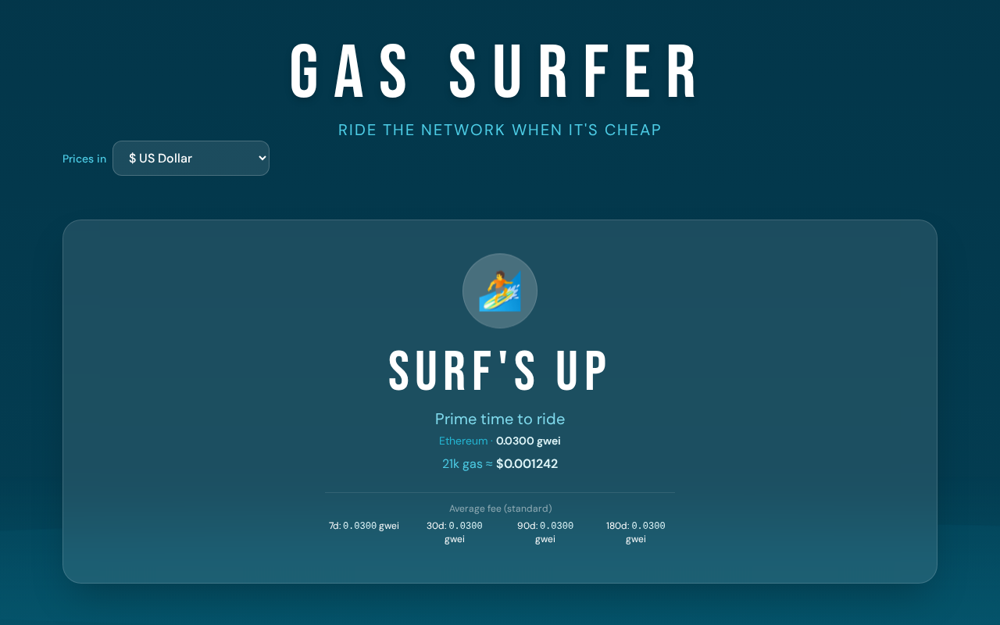
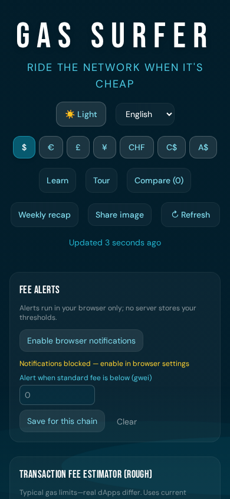
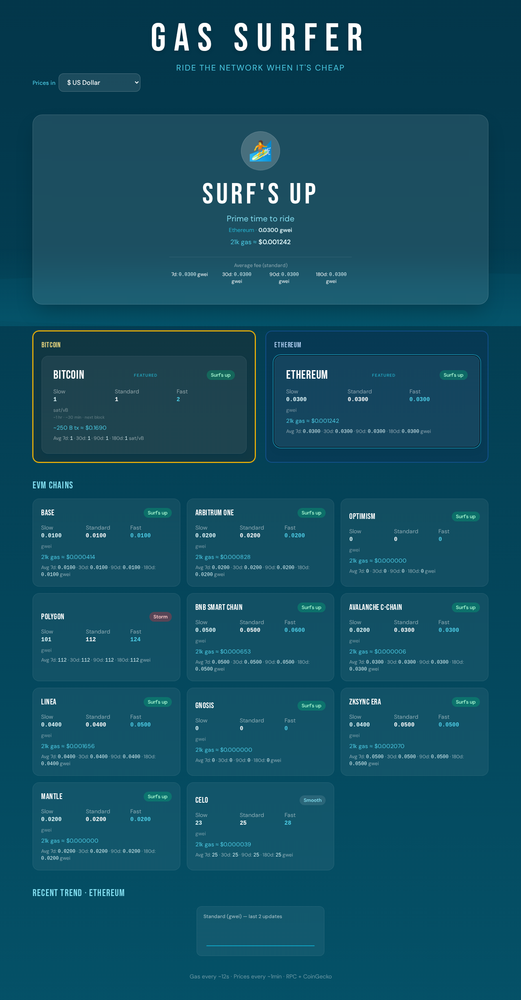

# Gas Surfer

**Ride the network when it's cheap.** Real-time gas and fee tracker for Bitcoin, Ethereum, and 13 EVM chains with a surf-report vibe.

**Version:** 0.1.0 · **Source:** [GitHub](https://github.com/dpastoetter/GasSurfer)

### Screenshots

| Desktop | Mobile | Full page |
|--------|--------|-----------|
| [](docs/screenshots/hero.png) | [](docs/screenshots/mobile.png) | [](docs/screenshots/full.png) |

---

## Features

- **Bitcoin & Ethereum** — Featured widgets with Slow / Standard / Fast (sat/vB for Bitcoin, gwei for EVM)
- **13 EVM chains** — Base, Arbitrum, Optimism, Polygon, BSC, Avalanche, Fantom, Linea, Gnosis, zkSync Era, Mantle, Celo
- **Multi-currency** — USD, EUR, GBP, JPY, CHF, CAD, AUD with live conversion
- **Surf conditions** — "Surf's up", "Smooth", "Choppy", or "Storm" from current fees
- **Fee averages** — 7 / 30 / 90 / 180-day averages (stored in browser)
- **Mini chart** — Recent fee trend for the selected chain
- **Auto-refresh** — Gas ~12s, prices ~1 min. No API keys required.

---

## Quick start

```bash
npm install
npm run dev
```

Open [http://localhost:5173](http://localhost:5173).

---

## Build & deploy

```bash
npm run build
npm run preview   # local preview of production build
```

Deploy the `dist/` folder to any static host (Vercel, Netlify, GitHub Pages, etc.). Production uses public RPC and API URLs; no backend needed.

---

## Tech stack

| Layer        | Choice                    |
|-------------|---------------------------|
| Build       | Vite 7                    |
| UI          | React 19 + TypeScript     |
| Styles      | Tailwind CSS v4           |
| Data        | Public RPCs, CoinGecko, mempool.space |

---

## Data sources

- **EVM gas** — `eth_gasPrice` via public RPCs (multiple fallbacks per chain)
- **Bitcoin fees** — [mempool.space](https://mempool.space) recommended fees (sat/vB)
- **Prices** — [CoinGecko](https://www.coingecko.com/en/api) simple/price (no key)

All URLs are allowlisted in `src/config/chains.ts` for safe use as a static website.

---

## Security

- **Reporting vulnerabilities** — See [SECURITY.md](SECURITY.md) for how to report security issues and for a short description of this project’s security model.
- **In short:** static site, no backend, no API keys; all endpoints are public and allowlisted; CSP and referrer policy are set in `index.html`; fee history stays in your browser only.

---

## Documentation

- **[docs/V0.1.md](docs/V0.1.md)** — Version 0.1 user guide and release notes
- **[docs/DEVELOPMENT.md](docs/DEVELOPMENT.md)** — Config, adding chains, project layout

---

## License

[MIT](LICENSE) — Copyright (c) Dominik Pastoetter.
