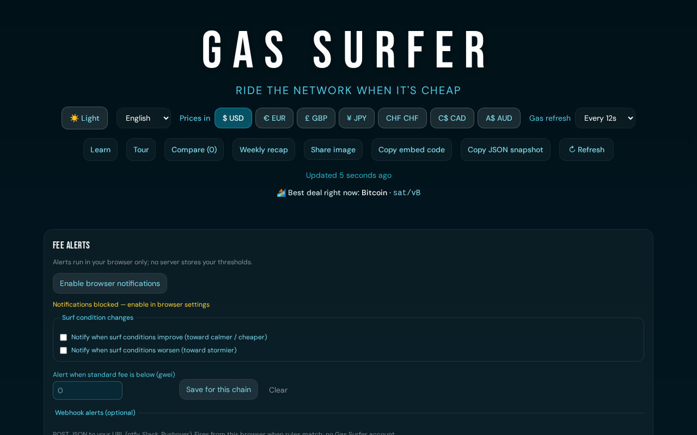
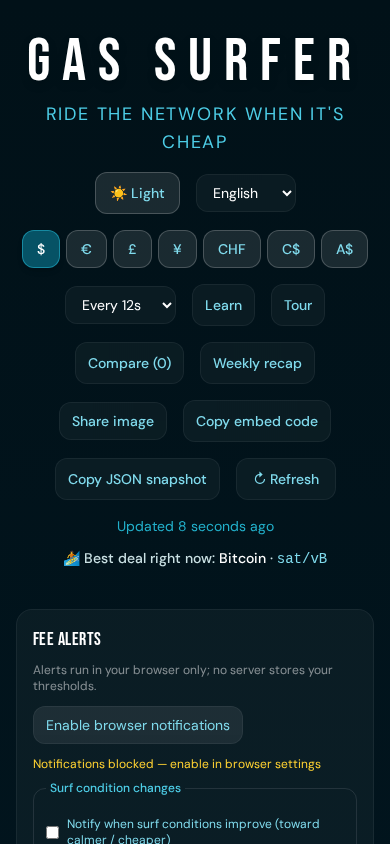
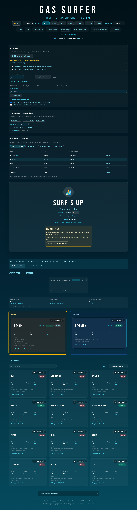

# Gas Surfer

**Ride the network when it's cheap.** Real-time gas and fee tracker for Bitcoin, Ethereum, and 13 EVM chains—with surf-style conditions, cross-chain fiat comparison, and privacy-first tooling (no account, no wallet).

**Version:** 0.1.0 · **Source:** [GitHub](https://github.com/dpastoetter/GasSurfer)

### Screenshots

_Regenerated May 2026 with `npm run screenshot` (dev server running; see [docs/DEVELOPMENT.md](docs/DEVELOPMENT.md#regenerating-screenshots) and [Pushing to GitHub](#pushing-to-github))._

| Desktop hero (1280×800) | Mobile (390×844) | Full page |
|------------------------|------------------|-----------|
| [](docs/screenshots/hero.png) | [](docs/screenshots/mobile.png) | [](docs/screenshots/full.png) |

---

## Features

### Live fees & surf report

- **Bitcoin & Ethereum** — Featured widgets with Slow / Standard / Fast (sat/vB for Bitcoin, gwei for EVM)
- **13 EVM chains** — Base, Arbitrum, Optimism, Polygon, BSC, Avalanche, Fantom, Linea, Gnosis, zkSync Era, Mantle, Celo
- **Surf conditions** — "Surf's up", "Smooth", "Choppy", or "Storm" from current fees (customizable per chain)
- **Multi-currency** — USD, EUR, GBP, JPY, CHF, CAD, AUD with live conversion
- **Fee averages** — 7 / 30 / 90 / 180-day averages (optional SQLite API or in-browser samples)
- **Trend vs 7d** — Current fee vs 7-day average on the hero and mini chart
- **Mini chart & card sparklines** — Recent standard-fee history for the selected chain and EVM cards
- **Auto-refresh** — Gas ~12s, prices ~1 min; no API keys on the static frontend
- **Copy fee** — One-click copy of the current chain’s standard fee

### When to send (decisions)

- **Send window score** — One verdict for the selected chain: *Great time to send*, *Rideable*, or *Hold off*—from surf condition, vs 7-day average, device calm hour (Ethereum tide), and whether another chain is cheaper. Optional **Remind me in 2 hours** calendar download (ICS).
- **Cheaper-chain callout** — Dismissible banner with fiat comparison and one-click switch when another network wins on a standard transfer (full app and widget).
- **Best chain for this action** — Rank top chains by estimated fiat cost for **transfer**, **ERC-20**, **NFT**, or **swap** gas limits (synced with `txPreset=` in the URL). Bridge costs are not included—see Learn.
- **Tx estimator** — Rough fee for preset gas limits on the selected EVM chain (+ fiat)
- **Best deal** — Header line highlighting the lowest standard-tx cost across all networks

### Alerts & local history

- **Fee alerts** — Browser notifications when standard fee drops below a threshold, or when surf condition improves / worsens (per chain)
- **Webhook alerts** — Optional **your** webhook URL (ntfy.sh, Slack incoming, Pushover, etc.); the browser POSTs when the same rules fire while the tab is open (no Gas Surfer account)
- **Condition toast** — Short in-app message when the selected chain’s condition rank changes
- **Tide table** — Ethereum-only calm-hours histogram from samples stored on this device (last 7 days)
- **Weekly recap** — Local 7-day stats with PNG share/download; nudge dot when enough samples exist

### Share, embed & install

- **Shareable URLs** — `chain`, `currency`, `lang`, `compare`, `txPreset`, `widget` synced via `replaceState` ([URL parameters](#url-parameters-shareable-links))
- **Favorites & compare** — Up to three chains side-by-side; **Copy link** in the compare dialog
- **Share images** — PNG snapshot of the current surf report; weekly recap image
- **Widget / kiosk** — `?widget=1` for a compact second-screen layout ([examples](#widget--kiosk-mode))
- **Embed route** — `/embed?chain=1` for iframes (sites, OBS); **Copy embed code** in the header
- **Status badges** — `/badge/{chainId}` renders a live SVG badge (e.g. for GitHub READMEs)
- **Installable PWA** — Icons, optional install prompt, manifest shortcut **Kiosk** → `/?widget=1&chain=1`

See [docs/INTEGRATIONS.md](docs/INTEGRATIONS.md) for iframe snippets, badge URLs, Stream Deck/OBS notes, and the optional status API.

### Trust & clarity

- **RPC source & freshness** — Per-chain data age and winning RPC / mempool host
- **RPC divergence** — “Fees uncertain” when two public RPC fallbacks disagree materially
- **Methodology** — How surf bands, EIP-1559, and Bitcoin tiers work (Learn drawer)
- **Stale / offline** — Clear banners; last good snapshot when offline
- **Learn & tour** — Gwei, L2, Bitcoin tiers, bridge context; optional onboarding

**Privacy:** No login, no wallet. [docs/PRIVACY.md](docs/PRIVACY.md) lists what leaves the browser (RPCs, mempool.space, CoinGecko, optional API).

---

## Quick start

From the **`gas-surfer`** directory:

```bash
cd gas-surfer
npm install
npm run dev
```

Open [http://localhost:5173](http://localhost:5173) (or the port Vite prints if 5173 is in use).

**Add to Home Screen (PWA):** Use **Install** when prompted, or the browser menu → “Install app”. Live gas still needs network access. The **Kiosk** shortcut opens widget mode.

**Try embed locally:** [http://localhost:5173/embed?chain=1&lang=en](http://localhost:5173/embed?chain=1&lang=en)

### URL parameters (shareable links)

The address bar stays in sync with core UI state (no extra history entries).

| Parameter   | Example | Meaning |
|------------|---------|---------|
| `chain`    | `chain=1` | Selected chain ID (`1` Ethereum, `0` Bitcoin, `8453` Base, …). |
| `currency` | `currency=eur` | Fiat: `usd`, `eur`, `gbp`, `jpy`, `chf`, `cad`, `aud`. |
| `lang`     | `lang=de` | UI: `en`, `de`, `es`. |
| `compare`  | `compare=1,8453` | Up to **three** allowlisted chain IDs; compare dialog opens if valid on load. |
| `txPreset` | `txPreset=nft` | Tx estimator / action ranking preset: `erc20`, `nft`, `swap`. |
| `widget`   | `widget=1` | Kiosk layout: surf report, send window score, trend, cheaper-chain callout—no full EVM grid or action table. |

**Examples**

| Use case | URL |
|----------|-----|
| Compare Ethereum + Base | `/?compare=1,8453&lang=en` |
| NFT fee estimate on L1 | `/?chain=1&txPreset=nft` |
| Kiosk / second monitor | `/?widget=1&chain=1&lang=en` |
| Iframe embed (production) | `https://gassurfer.app/embed?chain=8453&lang=en` |
| README badge | `https://gassurfer.app/badge/1` |

### Widget / kiosk vs embed

| Mode | Path / param | Best for |
|------|----------------|----------|
| **Widget** | `?widget=1` on main app | Same origin, minimal chrome, URL sync for chain/currency/lang |
| **Embed** | `/embed?chain=…` | Iframes on other sites; includes send window score + trend |
| **PWA Kiosk** | Manifest shortcut | Installed app opening widget URL |

Full dashboard (EVM grid, tide table, fee alerts, best-chain table) is the default at `/` without `widget`.

### Optional backend (fee averages & status API)

```bash
npm run dev:all   # API on :3001 + Vite on :5173
```

With the API running and ticks/snapshots stored:

- Long-window **fee averages** (`/api/averages`)
- Public **status JSON** for bots and dashboards: `GET /api/status` → chain conditions, standard fees, sources ([docs/INTEGRATIONS.md](docs/INTEGRATIONS.md))

See [docs/DEVELOPMENT.md](docs/DEVELOPMENT.md) for the database and deployment.

---

## Build & deploy

```bash
npm run build
npm run preview   # local preview of production build
```

Deploy the `dist/` folder to any static host (Vercel, Netlify, GitHub Pages, etc.). The app works without a backend; RPC and CoinGecko are called from the client. For long-window averages and `/api/status`, deploy the optional API behind the same host or a reverse proxy.

SPA routes (`/embed`, `/badge/1`) need a fallback to `index.html` (default on most static hosts).

---

## Tech stack

| Layer        | Choice                    |
|-------------|---------------------------|
| Build       | Vite 7                    |
| UI          | React 19 + TypeScript     |
| Styles      | Tailwind CSS v4           |
| Data        | Public RPCs, CoinGecko, mempool.space |
| Local       | IndexedDB fee samples, localStorage preferences |
| Backend (optional) | Node, Express, SQLite (sql.js) |

---

## Data sources

- **EVM gas** — Public RPCs with fallbacks; EIP-1559 when available, else `eth_gasPrice`
- **Bitcoin fees** — [mempool.space](https://mempool.space) recommended fees (sat/vB)
- **Prices** — [CoinGecko](https://www.coingecko.com/en/api) simple/price (no key)

Allowlisted in `src/config/chains.ts` for safe static hosting.

---

## Security

- **Reporting vulnerabilities** — [SECURITY.md](SECURITY.md)
- **Frontend:** static site, no API keys; CSP and referrer policy in `index.html`
- **Backend (optional):** rate limiting, CORS, validation — [docs/DEVELOPMENT.md](docs/DEVELOPMENT.md)

---

## Documentation

| Doc | Contents |
|-----|----------|
| [CONTRIBUTING.md](CONTRIBUTING.md) | Setup, tests, PR checklist |
| [docs/PRIVACY.md](docs/PRIVACY.md) | Outbound requests & on-device data |
| [docs/INTEGRATIONS.md](docs/INTEGRATIONS.md) | Embed, badges, `/api/status`, OBS / Stream Deck |
| [docs/DEVELOPMENT.md](docs/DEVELOPMENT.md) | Chains, URL sync, engagement hooks, API |
| [docs/V0.1.md](docs/V0.1.md) | User guide |
| [CHANGELOG.md](CHANGELOG.md) | Release notes |

**Tests:** `npm run lint` · `npm run test` · `npm run build` · `npm run test:e2e` (see [CONTRIBUTING.md](CONTRIBUTING.md#checks-before-a-pr)).

---

## Pushing to GitHub

- Run lint, test, build, and e2e in `gas-surfer` before pushing.
- `.gitignore` should exclude `node_modules`, `dist`, and `server/gas-surfer.db`.
- Refresh screenshots: `npx playwright install chromium`, start dev server, `npm run screenshot` ([details](docs/DEVELOPMENT.md#regenerating-screenshots)).

---

## License

[MIT](LICENSE)
